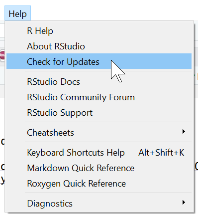
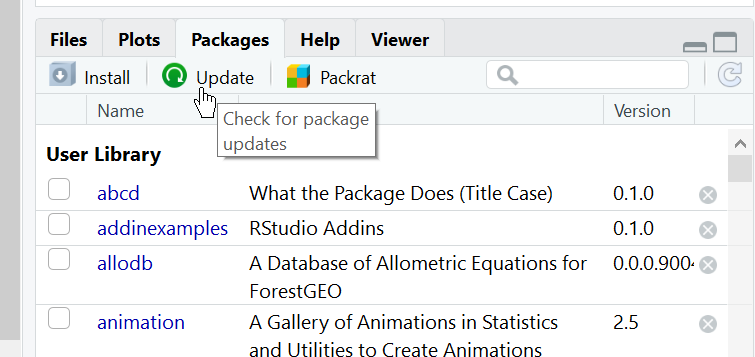

```{r setup, include=FALSE}
knitr::opts_chunk$set(
  echo = TRUE,
  collapse = TRUE
)
```

## Why update?


[Opinion by Jenny Bryan](https://fgeo.netlify.com/2018/03/06/2018-03-06-should-i-update-all-my-r-packages-frequently-yes-no-why/)

## Update R

```R
install.packages("installr")
installr::updater()
```

## Update RStudio



## Update packages



## Installing packages from GitHub

[Blog](https://fgeo.netlify.com/2018/02/05/2018-02-05-installing-packages-from-github/)

```R
install.packages("devtools")
devtools::install_github("forestgeo/fgeo")
```

