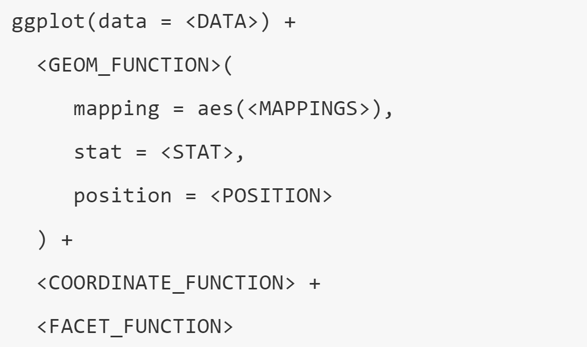
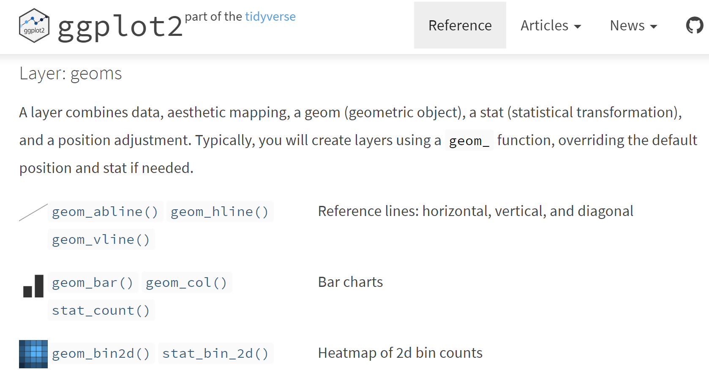
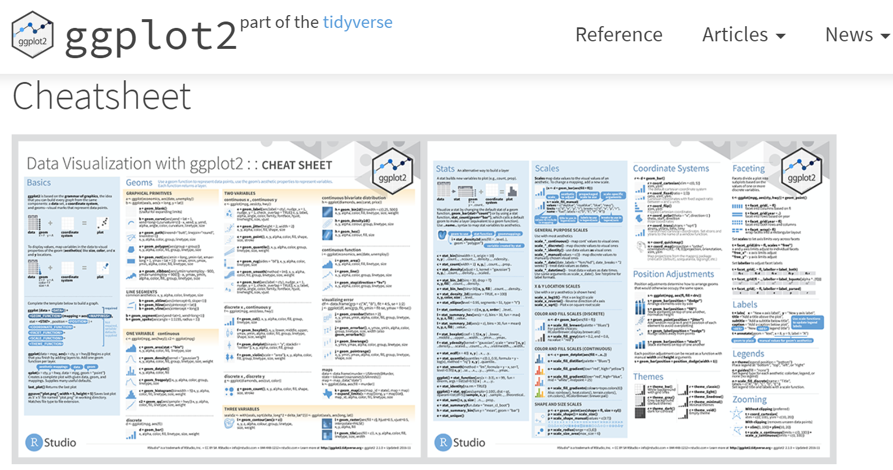

```{r setup, include=FALSE}
knitr::opts_chunk$set(
  echo = TRUE,
  collapse = TRUE
)
```

## Setup

```{r}
library(tidyverse)
tree <- read_csv("data/tree.csv")
```

## Subset data

```{r}
tree %>% 
  group_by(quadrat) %>% 
  summarise(n = n_distinct(sp)) %>% 
  arrange(desc(n)) %>% 
  top_n(1)
```

## Subset data

```{r}
top <- filter(tree, quadrat == 1516)
top
```


## Visualize all species in one panel

```{r}
ggplot(data = top, mapping = aes(x = gx, y = gy, colour = sp)) + 
  geom_point()
```

## Visualize one species in each panel

```{r}
ggplot(top, aes(gx, gy, colour = sp)) + 
  geom_point() +
  facet_wrap(vars(sp))
```

## The layered grammar of graphics



## https://ggplot2.tidyverse.org/reference/index.html



##



## Learn more

### [Data Visualisation (R for Data Science)](http://r4ds.had.co.nz/data-visualisation.html)

### [ggplot2: Elegant Graphics for Data Analysis](https://www.amazon.com/ggplot2-Elegant-Graphics-Data-Analysis/dp/331924275X/ref=as_li_ss_tl?ie=UTF8&linkCode=sl1&tag=ggplot2-20&linkId=4b4de5146fdafd09b8035e8aa656f300)
