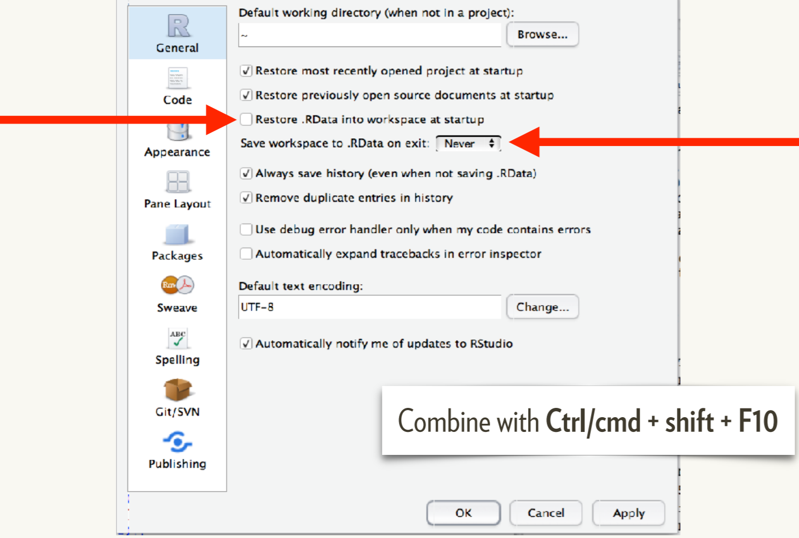
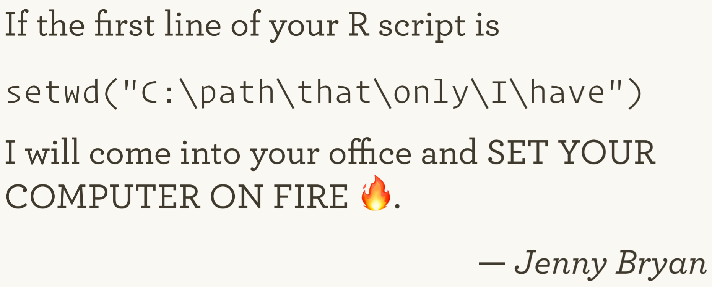
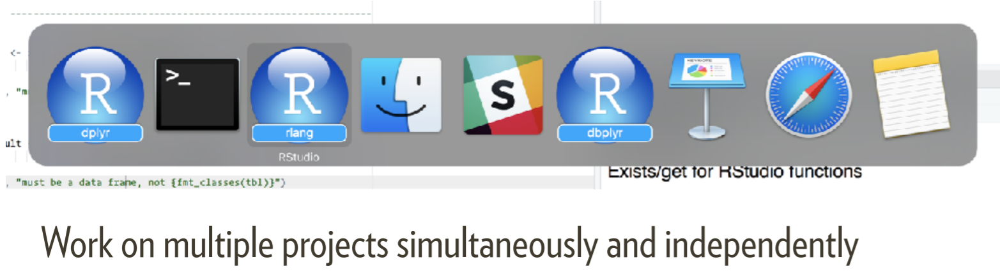
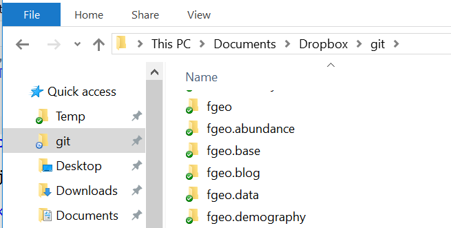
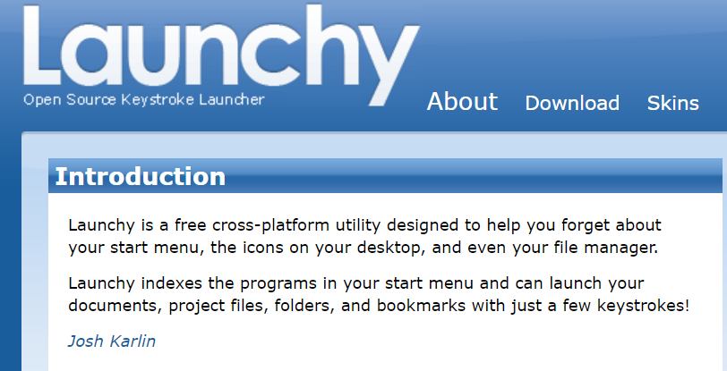
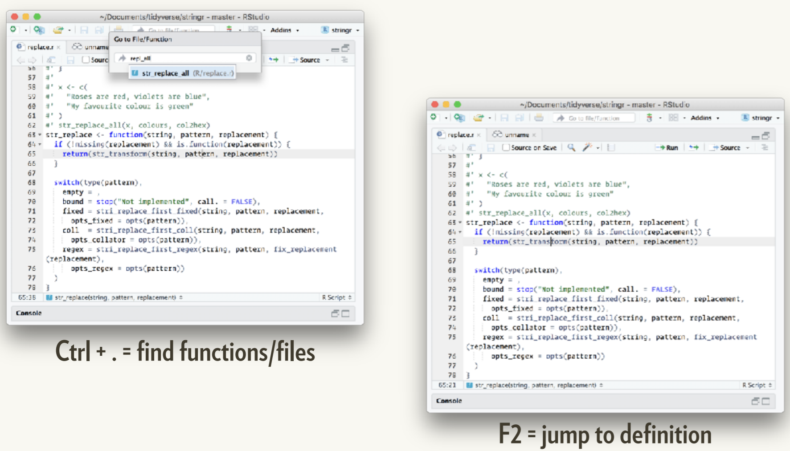
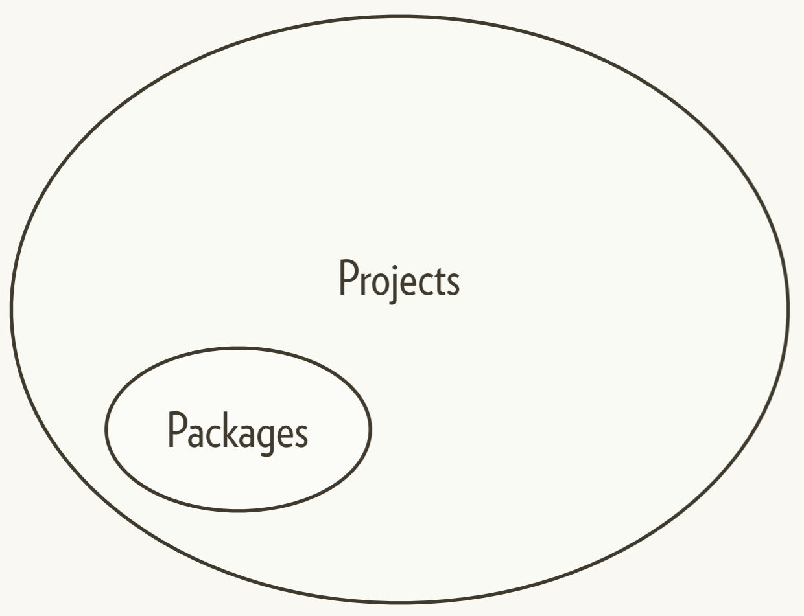
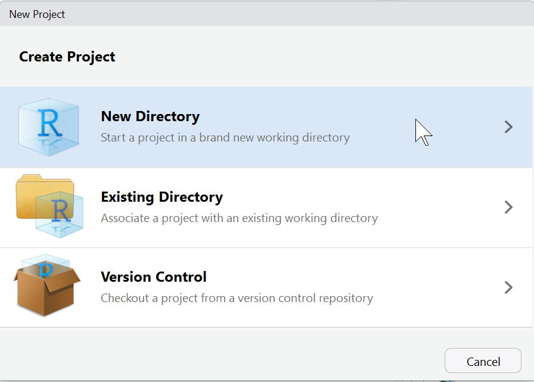
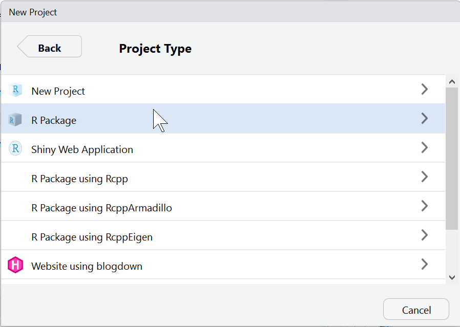
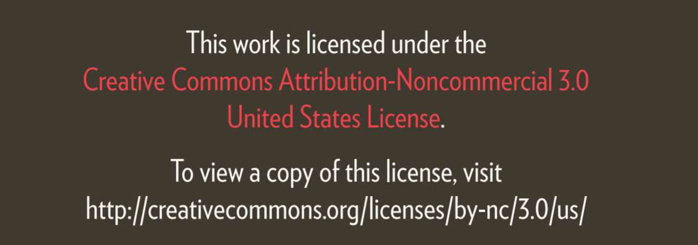

```{r setup, include=FALSE}
knitr::opts_chunk$set(
  echo = TRUE,
  collapse = TRUE
)
```

## R / RStudio setup



## Manage working directories



# RStudio projects and packages

### Why?

## 1. Work on multiple projects.



## Organize projects (example)



## http://www.launchy.net/



## 2. Click to open/set working directory


## 3. Enhanced navigation



## 



## Create a project



## Create a package (option 1)



## Create a package (option 2)

```R
usethis::create_package("abcd")
```

## Building Tidy Tools


## Building Tidy Tools



