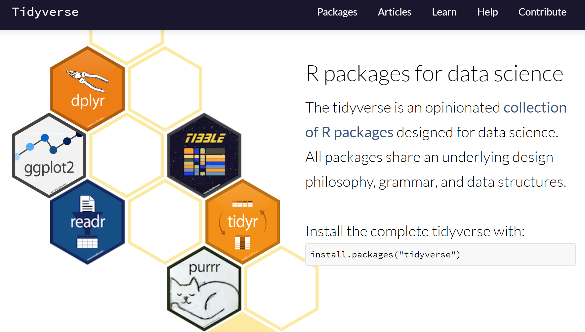
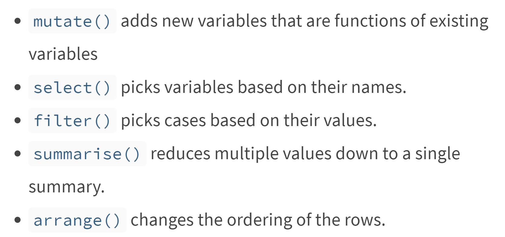
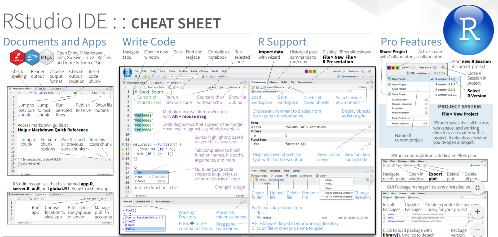

```{r setup, include=FALSE}
knitr::opts_chunk$set(
  echo = TRUE,
  collapse = TRUE
)
```

## Data Science http://r4ds.had.co.nz/


## https://www.tidyverse.org/



# Transform data (~80% of your time)

## Tools for data science

```{r}
library(tidyverse)
```

## Example dataset

```{r}
library(fgeo.data)
dim(luquillo_tree6_random)
```

## Overview

```{r}
luquillo_tree6_random
```

## Main verbs



```{r}
tree <- luquillo_tree6_random
```

## Filter rows with `filter()`

```{r}
filter(tree, sp == "PREMON", quadrat == "1017")
```
## Roughtly equivalent

```{r}
tree[tree$sp == "PREMON" & tree$quadrat == "1017", ]
```

## Arrange rows with `arrange()`

```{r}
arrange(tree, sp, quadrat)
```

## Arrange in descending order with `desc()`

```{r}
arrange(tree, desc(sp), quadrat)
```

## Select columns with `select()`

## Select by column name

```{r}
select(tree, sp, quadrat, treeID, status, dbh)
```

## Select range

```{r}
select(tree, treeID:quadrat)
```

## Exclude range

```{r}
select(tree, -(treeID:quadrat))
```

## Rename columns with `rename()`

```{r}
rename(tree, tree_id = treeID)
```

## Add new columns with mutate()

```{r}
mutate(tree, 
  dbh_mm = dbh,
  dbh_m = dbh_mm / 1000
)
```

## Keep the new variables with `transmute()`

```{r}
transmute(tree, 
  dbh_mm = dbh,
  dbh_m = dbh_mm / 1000
)
```

## Summarise values with `summarise()`

```{r}
summarise(tree,
  mean_dbh = mean(dbh, na.rm = TRUE)
)
```

## Randomly sample rows with `sample_n()`

```{r}
sample_n(tree, 5)
```

# Learn more

## https://www.rstudio.com/


## https://rstudio.cloud/learn/primers


## https://www.rstudio.com/resources/cheatsheets/


